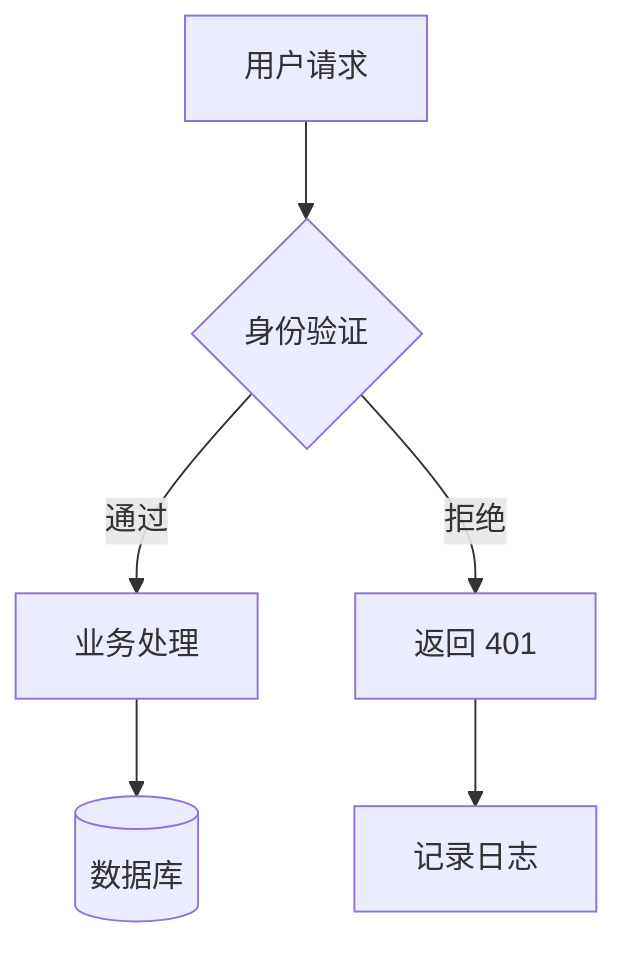

# Flowchart & Block

## 选型

- 有分支、循环、条件路由 → `flowchart`。必须指定方向。
- 无分支方块概览、节点 ≤ 12 → `block`。

## 方向与布局

### 整体方向

`LR` 优先。判断：图不长（能在横屏半宽内完整展示）→ `LR`；链太长会溢出 → `TB`。

### subgraph 方向（必须显式指定）

每个 subgraph 用 `direction` 声明内部方向，不允许依赖默认值。原则：**充分利用 subgraph 宽度**。

整体 `TB` 时，subgraph 内部：
- 节点**无连接** → `direction LR`，左右排开用满宽度
- 节点**有连接且链短** → `direction LR`，横向紧凑
- 节点**有连接且链长** → `direction TB`，与整体同向

整体 `LR` 时同理互换。

```
flowchart TB
  subgraph A[模块A — 链长用TB]
    direction TB
    P --> Q --> R --> S --> T
  end
  subgraph B[模块B — 无连接用LR]
    direction LR
    X
    Y
    Z
  end
```

### 隐式分层（subgraph 内无连接节点过多时）

节点数 ≥ 6 且无连接时，用 `~~~`（不可见连线）强制分层，如 9 节点 → 3 层 × 3 列、8 节点 → 2 层 × 4 列。

用 `linkStyle` 将分层连线的颜色设为 subgraph 底色，视觉上完全隐藏：

```
flowchart TB
  subgraph layers[分层展示]
    direction TB
    A1 & A2 & A3
    A1 ~~~ B1
    B1 & B2 & B3
    B1 ~~~ C1
    C1 & C2 & C3
  end
  linkStyle 0 stroke:#f9fafb,color:#f9fafb
  linkStyle 1 stroke:#f9fafb,color:#f9fafb
```

- `&` 将同行节点并排
- `~~~` 创建无箭头、不可见的桥接线，仅用于控制布局
- `linkStyle N` 按连线出现顺序编号（从 0 开始），色值必须与该 subgraph 的 `style fill` 一致（非固定值，取业务语义配色表中对应的 fill 色）

## 节点形状

```
A[矩形：实体/组件]    B(圆角：开始/结束)
C[(圆柱：数据库)]     D{菱形：决策/分支}
E[[方形：用户操作]]   F((圆形：连接点))
G[/平行四边形：输入输出/]
```

无特殊语义默认用矩形 `[...]`。

## 连接

```
A --> B         实线
A -- 标签 --> B  带标签
A -.-> B        虚线（异步/可选）
A ==> B         粗线（强调）
A -->|是| B     条件
```

## subgraph

### 全局默认（图表开头必须加）

Mermaid 默认 subgraph 背景为黄色。用 `%%{init}%%` 覆盖为白色：

```
%%{init: {'theme': 'base', 'themeVariables': {'clusterBkg': '#f9fafb', 'clusterBorder': '#d1d5db'}}}%%
```

### 语法

```
subgraph 前端
  A[React] --> B[API Client]
end
subgraph 后端
  C[Server] --> D[(Database)]
end
B --> C
```

### 业务语义着色

用 `style <subgraph-id>` 按业务边界着色。色值必须与同类 `classDef` 一致。

```
style frontend fill:#dbeafe,stroke:#3b82f6
style backend fill:#d1fae5,stroke:#10b981
```

| 语义 | fill | stroke | 对应 classDef | 场景 |
|------|------|--------|-------------|------|
| 前端/客户端 | `#dbeafe` | `#3b82f6` | `frontend` | Web、移动端、桌面端 |
| 后端/服务 | `#d1fae5` | `#10b981` | `backend` | API、微服务、Worker |
| 数据/存储 | `#ccfbf1` | `#14b8a6` | `database` | 数据库、缓存、MQ |
| 核心业务 | `#ede9fe` | `#8b5cf6` | `business` | 订单、支付、用户 |
| 外部/第三方 | `#f3f4f6` | `#9ca3af` | `external` | 支付网关、短信、OAuth |
| 网关/入口 | `#e0f2f1` | `#00897b` | `gateway` | Nginx、Kong、Gateway |
| 安全/隔离区 | `#fee2e2` | `#ef4444` | `danger` | DMZ、沙箱、防火墙 |
| 基础设施 | `#fef3c7` | `#f59e0b` | `pending` | K8s、监控、CI/CD |
| 废弃/下线 | `#f9fafb` | `#d1d5db` | `disabled` | 旧系统、迁移中 |

废弃/下线 subgraph 的 `style` 追加 `stroke-dasharray: 5 5` 虚线边框。

### 完整示例

```
%%{init: {'theme': 'base', 'themeVariables': {'clusterBkg': '#f9fafb', 'clusterBorder': '#d1d5db'}}}%%
flowchart TB
  subgraph frontend[前端]
    A[Web App] --> B[API Client]
  end
  subgraph backend[后端服务]
    C[Gateway] --> D[Order Service] --> E[(Database)]
  end
  subgraph external[外部系统]
    F[支付网关]
  end
  B --> C
  D --> F

  style frontend fill:#dbeafe,stroke:#3b82f6
  style backend fill:#d1fae5,stroke:#10b981
  style external fill:#f3f4f6,stroke:#9ca3af
```

## 配色（classDef + class）

按语义选 3-5 个 class，不必全用。一个节点可叠加：`class X frontend,highlight`。

### 安全/风险组

```
classDef danger fill:#fee2e2,stroke:#ef4444,color:#7f1d1d
classDef critical fill:#fce4ec,stroke:#e91e63,color:#880e4f
classDef risk fill:#fff3e0,stroke:#ff9800,color:#e65100
classDef safe fill:#e8f5e9,stroke:#4caf50,color:#1b5e20
classDef blocked fill:#f3e5f5,stroke:#9c27b0,color:#4a148c
```

| 类名 | 语义 | 示例 |
|------|------|------|
| `danger` | 危险/漏洞/攻击面 | XSS 注入点、未加密通道 |
| `critical` | 严重/紧急 | P0 故障、数据泄露 |
| `risk` | 风险/需关注 | 权限过大、日志缺失 |
| `safe` | 安全/已加固 | 加密传输、沙箱隔离 |
| `blocked` | 已拦截/已修复 | WAF 命中、漏洞已 patch |

### 业务/领域组

```
classDef frontend fill:#dbeafe,stroke:#3b82f6,color:#1e3a5f
classDef backend fill:#d1fae5,stroke:#10b981,color:#064e3b
classDef database fill:#ccfbf1,stroke:#14b8a6,color:#134e4a
classDef business fill:#ede9fe,stroke:#8b5cf6,color:#3b0764
classDef external fill:#f3f4f6,stroke:#9ca3af,color:#1f2937
classDef gateway fill:#e0f2f1,stroke:#00897b,color:#004d40
```

| 类名 | 语义 | 示例 |
|------|------|------|
| `frontend` | 前端/UI/客户端 | React 组件、移动端 |
| `backend` | 后端服务/API | Controller、Service、gRPC |
| `database` | 数据库/存储/MQ | PostgreSQL、Redis、Kafka |
| `business` | 核心业务/领域实体 | 订单、用户、支付 |
| `external` | 外部系统/第三方 | 短信网关、支付渠道 |
| `gateway` | 网关/负载均衡/代理 | Nginx、Kong、Envoy |

### 状态/质量组

```
classDef success fill:#dcfce7,stroke:#22c55e,color:#14532d
classDef pending fill:#fef3c7,stroke:#f59e0b,color:#78350f
classDef failed fill:#fee2e2,stroke:#ef4444,color:#7f1d1d
classDef disabled fill:#f9fafb,stroke:#d1d5db,color:#9ca3af
classDef highlight fill:#fce7f3,stroke:#ec4899,color:#831843
```

| 类名 | 语义 | 示例 |
|------|------|------|
| `success` | 成功/通过/推荐 | 最佳路径、测试通过 |
| `pending` | 待定/进行中 | 异步处理、审批中 |
| `failed` | 失败/错误/不可达 | 调用失败、超时 |
| `disabled` | 禁用/废弃/不可用 | 已下线服务、废弃 API |
| `highlight` | 核心/关键路径 | 主要流程、关键节点 |

### 基础设施组

```
classDef compute fill:#e3f2fd,stroke:#1e88e5,color:#0d47a1
classDef network fill:#e8eaf6,stroke:#5c6bc0,color:#1a237e
classDef config fill:#fff8e1,stroke:#fdd835,color:#f57f17
classDef monitor fill:#fce4ec,stroke:#c62828,color:#b71c1c
classDef storage fill:#e0f2f1,stroke:#00695c,color:#004d40
```

| 类名 | 语义 | 示例 |
|------|------|------|
| `compute` | 计算/容器/进程 | Docker、K8s Pod |
| `network` | 网络/负载均衡/CDN | VPC、ELB、CloudFront |
| `config` | 配置/环境变量/密钥 | env、ConfigMap、Secrets |
| `monitor` | 监控/告警/日志 | Prometheus、Sentry、ELK |
| `storage` | 持久化存储/卷 | EBS、NFS、S3 |

### 数据/访问频率组

```
classDef hot fill:#ffebee,stroke:#f44336,color:#b71c1c
classDef warm fill:#fff3e0,stroke:#ff9800,color:#e65100
classDef cold fill:#e8eaf6,stroke:#5c6bc0,color:#1a237e
classDef cache fill:#fff9c4,stroke:#fdd835,color:#f57f17
```

| 类名 | 语义 | 示例 |
|------|------|------|
| `hot` | 热数据/高频访问 | 实时排行榜、会话状态 |
| `warm` | 温数据/中频访问 | 近期订单、活跃用户 |
| `cold` | 冷数据/归档 | 历史日志、审计记录 |
| `cache` | 缓存/加速层 | Redis 缓存、CDN 边缘 |

### 角色/人员组

```
classDef user fill:#e3f2fd,stroke:#42a5f5,color:#0d47a1
classDef admin fill:#f3e5f5,stroke:#ab47bc,color:#4a148c
classDef system fill:#eceff1,stroke:#78909c,color:#263238
```

| 类名 | 语义 | 示例 |
|------|------|------|
| `user` | 普通用户/终端用户 | 访客、会员 |
| `admin` | 管理员/运维 | 后台管理、运维面板 |
| `system` | 系统/自动化 | 定时任务、自动扩缩容 |

### class 使用示例



## block 语法

```
block-beta
  columns 3
  Frontend:1 Backend:1 Database:1
```

block 不支持 classDef 和 subgraph style。

## 大小限制

- **flowchart**：超 30 节点或 40 边 → 按 subgraph 边界拆为多张子图。
- **block**：超 12 块 → 改用 flowchart。
