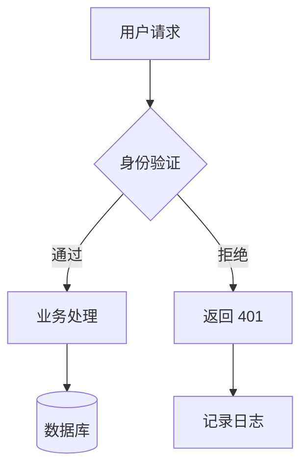

# Flowchart & Block

## 选型

- **flowchart**：有分支、循环、条件路由时用。必须指定方向。
- **block**：无分支的方块级概览，节点数少（< 12）。

## 方向

必须指定 `TB`（上→下，流程步骤）或 `LR`（左→右，架构全景）。

## 节点形状

```
A[矩形：实体/组件]    B(圆角：开始/结束)
C[(圆柱：数据库)]     D{菱形：决策/分支}
E[[方形：用户操作]]   F((圆形：连接点))
G[/平行四边形：输入输出/]
```

无特殊语义时默认用矩形 `[...]`。

## 连接与标签

```
A --> B         实线箭头
A -- 标签 --> B  带标签
A -.-> B        虚线（异步/可选）
A ==> B         粗线（强调）
A -->|是| B     条件标签
A -->|否| C
```

## subgraph 分组

```
subgraph 前端
  A[React] --> B[API Client]
end
subgraph 后端
  C[Server] --> D[(Database)]
end
B --> C
```

## 配色（classDef + class）

按语义分组，颜色可在不同组重复定义（类名不重即可）。选匹配语义的 3-5 个 class 使用，不必全用。

### 安全/风险组

```
classDef danger fill:#fee2e2,stroke:#ef4444,color:#7f1d1d
classDef critical fill:#fce4ec,stroke:#e91e63,color:#880e4f
classDef risk fill:#fff3e0,stroke:#ff9800,color:#e65100
classDef safe fill:#e8f5e9,stroke:#4caf50,color:#1b5e20
classDef blocked fill:#f3e5f5,stroke:#9c27b0,color:#4a148c
```

| 类名 | 语义 | 示例 |
|------|------|------|
| `danger` | 危险/漏洞/攻击面 | XSS 注入点、未加密通道 |
| `critical` | 严重/紧急/需立即处理 | P0 故障节点、数据泄露路径 |
| `risk` | 风险/需关注 | 权限过大、日志缺失 |
| `safe` | 安全/已加固 | 加密传输、沙箱隔离 |
| `blocked` | 已拦截/已修复 | WAF 规则命中、漏洞已 patch |

### 业务/领域组

```
classDef frontend fill:#dbeafe,stroke:#3b82f6,color:#1e3a5f
classDef backend fill:#d1fae5,stroke:#10b981,color:#064e3b
classDef database fill:#ccfbf1,stroke:#14b8a6,color:#134e4a
classDef business fill:#ede9fe,stroke:#8b5cf6,color:#3b0764
classDef external fill:#f3f4f6,stroke:#9ca3af,color:#1f2937
classDef gateway fill:#e0f2f1,stroke:#00897b,color:#004d40
```

| 类名 | 语义 | 示例 |
|------|------|------|
| `frontend` | 前端/UI/客户端 | React 组件、移动端、WebView |
| `backend` | 后端服务/API | Controller、Service、gRPC |
| `database` | 数据库/存储/消息队列 | PostgreSQL、Redis、Kafka |
| `business` | 核心业务/领域实体 | 订单、用户、支付 |
| `external` | 外部系统/第三方 | 短信网关、支付渠道、OAuth |
| `gateway` | API 网关/负载均衡/代理 | Nginx、Kong、Envoy |

### 状态/质量组

```
classDef success fill:#dcfce7,stroke:#22c55e,color:#14532d
classDef pending fill:#fef3c7,stroke:#f59e0b,color:#78350f
classDef failed fill:#fee2e2,stroke:#ef4444,color:#7f1d1d
classDef disabled fill:#f9fafb,stroke:#d1d5db,color:#9ca3af
classDef highlight fill:#fce7f3,stroke:#ec4899,color:#831843
```

| 类名 | 语义 | 示例 |
|------|------|------|
| `success` | 成功/通过/推荐 | 最佳路径、测试通过 |
| `pending` | 待定/进行中/需等待 | 异步处理中、审批中 |
| `failed` | 失败/错误/不可达 | 调用失败、超时、异常 |
| `disabled` | 禁用/废弃/不可用 | 已下线的服务、废弃 API |
| `highlight` | 核心/关键路径 | 主要流程、关键节点 |

### 基础设施组

```
classDef compute fill:#e3f2fd,stroke:#1e88e5,color:#0d47a1
classDef network fill:#e8eaf6,stroke:#5c6bc0,color:#1a237e
classDef config fill:#fff8e1,stroke:#fdd835,color:#f57f17
classDef monitor fill:#fce4ec,stroke:#c62828,color:#b71c1c
classDef storage fill:#e0f2f1,stroke:#00695c,color:#004d40
```

| 类名 | 语义 | 示例 |
|------|------|------|
| `compute` | 计算/容器/进程 | Docker、K8s Pod、Serverless |
| `network` | 网络/负载均衡/CDN | VPC、ELB、CloudFront |
| `config` | 配置/环境变量/密钥 | env、ConfigMap、Secrets |
| `monitor` | 监控/告警/日志 | Prometheus、Sentry、ELK |
| `storage` | 持久化存储/卷 | EBS、NFS、S3 |

### 数据/访问频率组

```
classDef hot fill:#ffebee,stroke:#f44336,color:#b71c1c
classDef warm fill:#fff3e0,stroke:#ff9800,color:#e65100
classDef cold fill:#e8eaf6,stroke:#5c6bc0,color:#1a237e
classDef cache fill:#fff9c4,stroke:#fdd835,color:#f57f17
```

| 类名 | 语义 | 示例 |
|------|------|------|
| `hot` | 热数据/高频访问 | 实时排行榜、会话状态 |
| `warm` | 温数据/中频访问 | 近期订单、活跃用户 |
| `cold` | 冷数据/归档 | 历史日志、审计记录 |
| `cache` | 缓存/加速层 | Redis 缓存、CDN 边缘 |

### 角色/人员组

```
classDef user fill:#e3f2fd,stroke:#42a5f5,color:#0d47a1
classDef admin fill:#f3e5f5,stroke:#ab47bc,color:#4a148c
classDef system fill:#eceff1,stroke:#78909c,color:#263238
```

| 类名 | 语义 | 示例 |
|------|------|------|
| `user` | 普通用户/终端用户 | 访客、会员 |
| `admin` | 管理员/运维 | 后台管理、运维面板 |
| `system` | 系统/自动化 | 定时任务、自动扩缩容 |

### 使用方式



一个节点可叠加多个 class：`class X frontend,highlight`。

## block 语法

```
block-beta
  columns 3
  Frontend:1 Backend:1 Database:1
```

block 不支持 classDef。

## 大小限制

- **flowchart**：超 30 节点或 40 边时提示拆分。按 subgraph 边界拆为多张子图。
- **block**：超 12 块时提示改用 flowchart。
